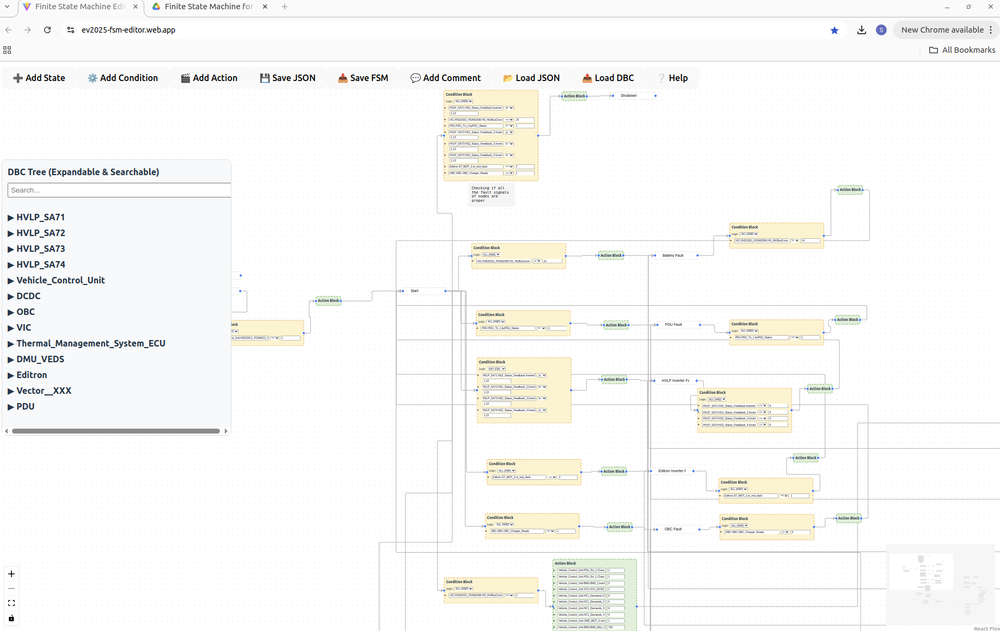

# ev-2025-fsm-editor

# FSM Editor

🚀 **Launch here**: [ev2025-fsm-editor.web.app](https://ev2025-fsm-editor.web.app/)

---

## 📋 Overview

The FSM Editor is a powerful visual tool for designing **Finite State Machines** (FSMs) for embedded systems, particularly targeting **Qt for Embedded** and **vehicle control logic**.

You can easily:

- **Load a DBC file** to pick vehicle signals
- **Drag and drop** State, Condition, Action, and Comment blocks
- **Connect nodes** visually to form your FSM
- **Click on signals** to build conditions and actions
- **Save FSM** directly into a clean JSON format ready for embedded use

---

## 🛠 Main Features

| Feature                     | Details                                                     |
| --------------------------- | ----------------------------------------------------------- |
| 📤 Load DBC File            | Parses signals into a tree structure                        |
| ➕ Add State Node           | Create FSM states                                           |
| ⚙️ Add Condition Block      | Create conditions to trigger transitions                    |
| 🎬 Add Action Block         | Assign values to signals during transitions                 |
| 💬 Add Comment Box          | Add free-floating notes anywhere                            |
| 📂 Load JSON                | Load a previously saved FSM drawing                         |
| 💾 Save Drawing             | Save the visual graph layout (ReactFlow format)             |
| 📥 Save FSM                 | Export final FSM in **ready-to-deploy JSON**                |
| 🔍 Search DBC Signals       | Search by Node, Message, Signal, Comment, Value Description |
| 🖱️ Click Signal to Insert   | Quickly populate conditions and actions                     |
| 📈 Highlight Selected Block | Selected blocks visually highlighted                        |

---

## 🔥 How to Use

1. **Load a DBC file** to bring in vehicle signals
2. **Add State nodes** representing different FSM states
3. **Connect State ➔ Condition ➔ Action ➔ Next State**
4. **Click on DBC signals** to auto-populate Conditions or Actions
5. **Use `in`, `eq`, `ne`, etc. operators** while defining conditions
6. **Save your FSM** as JSON — ready to embed inside your Qt project!

---

## ⚡ Quick Buttons Guide

| Button           | Description                     |
| ---------------- | ------------------------------- |
| ➕ Add State     | Add a new FSM state node        |
| ⚙️ Add Condition | Create a condition block        |
| 🎬 Add Action    | Create an action block          |
| 💬 Add Comment   | Create a comment box            |
| 📥 Save FSM      | Save the full FSM as clean JSON |
| 📂 Load JSON     | Load a previous project drawing |
| 📤 Load DBC      | Load a DBC file for signals     |
| ❔ Help          | View instructions and tips      |

---

## 📸 Screenshot

>  

---

## 📚 Notes

- Only **Vehicle_Control_Unit** signals are allowed inside Action blocks.
- Conditions can now use **IN** operator for multiple values.
- Double-click edges to rename.
- Right-click edges to delete.
- Comments are free-floating notes you can drag and drop.

---

## 🧠 Pro Tip

Before saving your FSM:

- Make sure you **set the Initial State** (the starting point of the FSM).

The tool will prompt you automatically if you forget!

---

# 🚀 Start Building your FSM:

👉 **[Click here to launch the editor](https://ev2025-fsm-editor.web.app/)**

---
